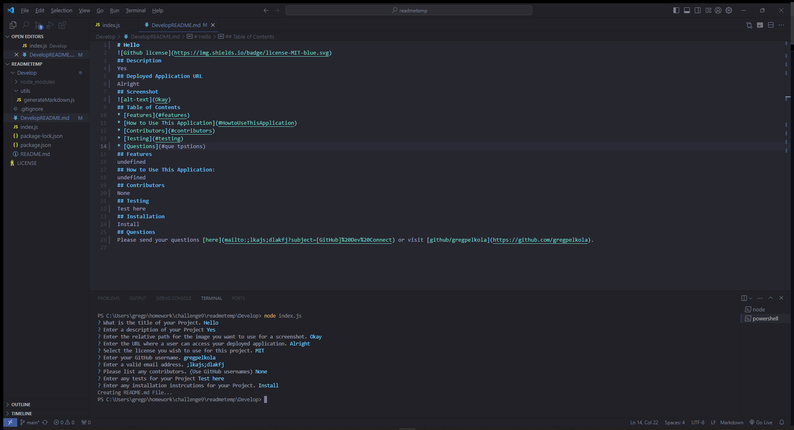

# readmetemp 

## Description
A readme template using the CLI to generate a readme quickly.
## Deployed Application URL
https://github.com/gregpelkola/readmetemp
## Screenshot

## Table of Contents
* [Features](#features)
* [How to Use This Application](#HowtoUseThisApplication)
* [Contributors](#contributors)
* [Testing](#testing)
* [Questions](#questions)
## Features

## How to Use This Application:
Open in VS Code and right click on the index.js then click open in integrated terminal, then type node index.js and hit enter to be given prompts. Answer prompts and hit enter to confrim, once all prompts have been answered navigate the DevelopREADME.md to see the generated readme with the data that you entered.
## Contributors

## Testing

## Installation
Clone the repository, save to the directory you would like. 
## Questions
Please send your questions [here](mailto:141973953+gregpelkola@users.noreply.github.com) or visit [github/gregpelkola](https://github.com/gregpelkola).
